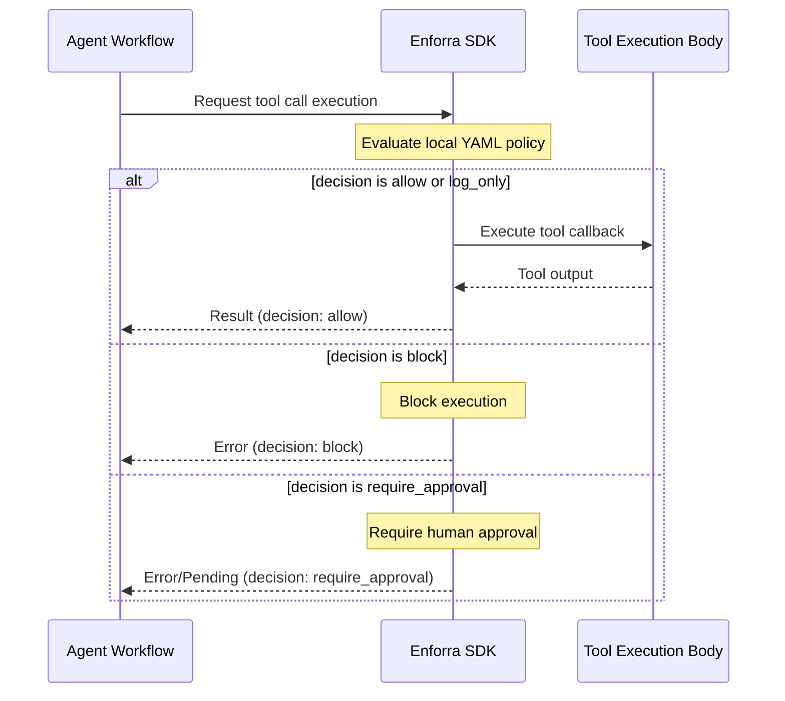

# Enforra Starter Templates

These are copyable starter projects for adding Enforra policy checks before AI agent tool execution.

Unlike the main `examples/` directory (which shows advanced configurations inside the monorepo), these templates are designed to be copy-pasted directly into your own repositories. They use standard public package releases and require no local development hooks.

## Available Templates

| Goal                  | Template            | Language | Install     |
| --------------------- | ------------------- | -------- | ----------- |
| Generic Node agent    | node-agent          | Node.js  | npm install |
| Generic Python agent  | python-agent        | Python   | pip install |
| MCP-style tool server | mcp-server          | Node.js  | npm install |
| LangGraph agent       | langgraph-agent     | Python   | pip install |
| Vercel AI SDK agent   | vercel-ai-sdk-agent | Node.js  | npm install |

## Guidance

- Start with **[node-agent](./node-agent)** or **[python-agent](./python-agent)** if you are building a custom agent from scratch or want to learn Enforra SDK fundamentals.
- Start with **[mcp-server](./mcp-server)** if you want to wrap Model Context Protocol style tool handlers.
- Start with **[langgraph-agent](./langgraph-agent)** if your agent tools run through a LangGraph workflow.
- Start with **[vercel-ai-sdk-agent](./vercel-ai-sdk-agent)** if you define tools and execute them via the Vercel AI SDK.

## Common Interception Pattern

Every template follows Enforra's core design doctrine where policy enforcement wraps tool calls before any side effects happen:

1. **Framework or agent decides to call a tool**: The tool name, agent name, and arguments are captured.
2. **Enforra checks policy before the tool body runs**: Local policies are evaluated.
3. **The handler executes only for `allow` or `log_only`**: If the policy allows, the actual tool body runs.
4. **`block` and `require_approval` do not execute the handler**: The tool is intercepted beforehand, preventing any side effects.
5. **Audit logs are written locally**: Event logs are formatted and written to `.enforra/audit.jsonl`.
